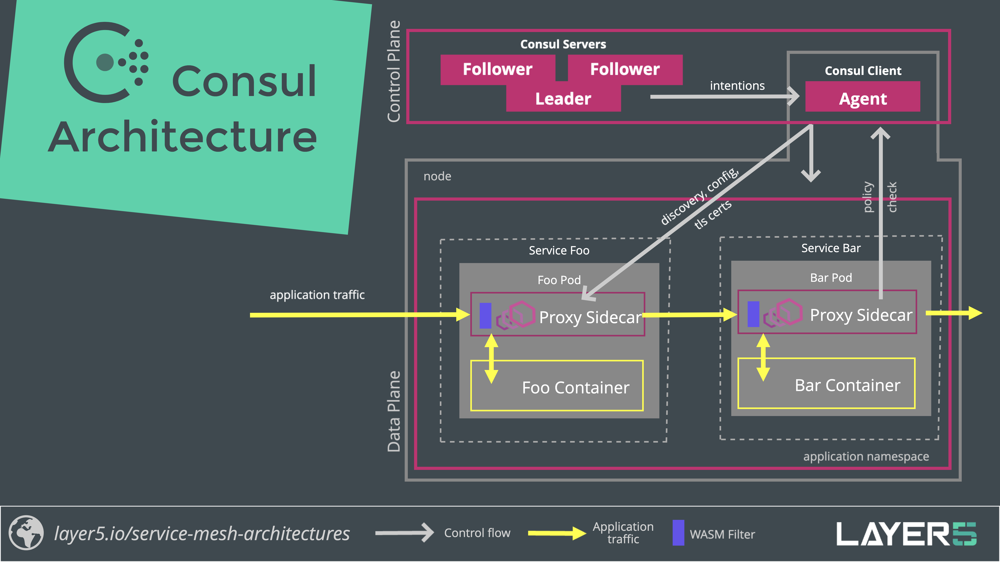
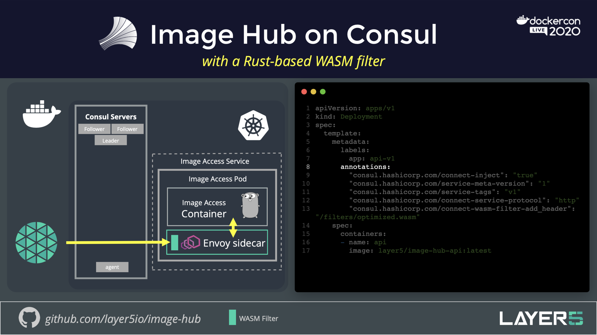

<p style="text-align:center;"><a href="https://layer5.io/meshery"></a><h1>Layer5 Image Hub</h1></p>

[](https://goreportcard.com/report/github.com/layer5io/image-hub)
[](LICENSE)
[](https://github.com/issues?utf8=✓&q=is%3Aopen+is%3Aissue+archived%3Afalse+org%3Alayer5io+label%3A%22help+wanted%22+")
[](https://layer5.io/)
[](https://twitter.com/intent/follow?screen_name=layer5)
[](http://slack.layer5.io)
[](https://bestpractices.coreinfrastructure.org/projects/3564)

<p align="center"><i>If you’re using the Image Hub or if you like other Layer5 projects, please <a href="https://github.com/layer5io/image-hub/stargazers">★</a> star this repository to show your support! 🤩</i></p>

## Image Hub
Image Hub is a sample application written to run on [Consul](https://meshery.layer5.io/docs/service-meshes/adapters/consul) for exploring WebAssembly modules used as Envoy filters. This demo application has been enabled by experimental works of [Nic Jackson](https://twitter.com/sheriffjackson) of HashiCorp, and [Kanishkar J](https://twitter.com/_kanishkarj_), [Lee Calcote](https://twitter.com/lcalcote), and other contributors of Layer5.


## Deployment Instructions

Image Hub supports Envoy-based data planes. Deployment instructions for each supported service mesh are below.

### Using Istio (pending [PR #196](https://github.com/layer5io/meshery-istio/pull/196)+release; clone and do make run for now):
1) Use [Meshery](https://github.com/layer5io/meshery) to deploy [istio](https://github.com/layer5io/advanced-istio-service-mesh-workshop/blob/master/lab-1/README.md) and the Image Hub sample application (Management > Istio > Manage Sample Application Lifecycle > Image-Hub ) onto the Istio service mesh.
2) To map `imagehub.meshery.io` to the appropriate IP, run the following command to add the appropriate entry in the `"\etc\hosts"` file: 

    ```
    echo $(kubectl get nodes --selector=kubernetes.io/role!=master -o jsonpath={.items[0].status.addresses[?\(@.type==\"InternalIP\"\)].address})'    'imagehub.meshery.io | sudo tee -a /etc/hosts
    ```
3) To get the environment port, run the following command:
    ```
    echo $(kubectl get svc istio-ingressgateway -n istio-system -o jsonpath='{.spec.ports[1].nodePort}')
    ```
4) Access the web UI using:
    ```
    http://imagehub.meshery.io:<environment port>
    ```


### Using Consul:

1) Deploy the latest Consul:

    ```bash
    helm repo add hashicorp https://helm.releases.hashicorp.com # Adds helm hashicorp repo
    helm install consul hashicorp/consul -f config/consul-values.yaml # Setup custom Consul with support for WASM
    ```

2) Use [Meshery](https://github.com/layer5io/meshery) to deploy the Image Hub sample application onto the Consul service mesh.

3) Find the port assigned to the `ingess` service:

    ```
    kubectl get svc ingess
    NAME     TYPE       CLUSTER-IP    EXTERNAL-IP   PORT(S)        AGE
    ingess   NodePort   10.97.34.25   <none>        80:31118/TCP   27m
    ```

4) Open http://localhost:31118 (where 31118 is your environment's port number).

## Use Image Hub

1. Upon visiting the image-hub homepage, we would need to signup for an account! Go ahead and click the "Sign Up" button in the top right.
1. Enter the login details, and select a plan; Personal gives you 10 pulls per minute, Team gives you 100 pulls per minute, and Enterprise will give you 1000 pulls per minute.
1. After signing up, you should be redirected to the login page, where you can login and start using the sample app.
1. On the main page, open up the network network tab, and reload the page. This will allow you to see the request-response of the app.
1. Go ahead and click the download button a couple of times. You'll notice that there is nothing actually limiting you from crossing the number of pulls according to the plan you chose!
1. Alternatively you could test the above by navigating to http://imagehub.meshery.io:<environment port>/pull, and then looking at the resquest-responses.

## Deploying the Rate Limiter WASM Filter for Envoy

1. Go back to Management > Istio and under "Apply Service Mesh Configuration" make sure to apply "Automatic Sidecar Injection"
1. Open up a terminal, and run `kubectl get pods` to get a list of running pods. You should be able to see 2 pods, `web` and `api`. Now run 
the command `kubectl delete pods <exact web pod name> <exact api pod name>`. This will cause kubernetes to respawn them with the updated configuration.
1. Go back to Management > Istio and under "Apply Service Mesh Configuration", select the `Envoy Filter for Image Hub` option, and wait for a few seconds.

## Use Image hub with a WASM filter

1. Test your ability to "pull" an image (images are not in fact pulled, but an HTTP request is sent to the backend `api`). You would not be able to pull an image, and the response would say "unauthorized".
1. Sign up a new user and select a subscription plan.
1. Login as that user.
1. Test your ability to "pull" an image. You should be able to pull an image.
1. Open Meshery's performance management page (http://localhost:9081/performance)
1. Configure a performance test against http://x.x.x.x:31118/api/pull (where x.x.x.x is your machine's host IP address, not "localhost")
1. Enter `{ "authorization" : "<your user's token>" }`
1. Run the performance test. See that your subscription plan limit is enforced accordingly.
1. Change your subscription plan and retest.

## Architecture

### Consul Service Mesh Architecture w/WebAssembly


### Image Hub deployed on Consul


## Presentations

<a href="https://www.youtube.com/watch?v=5BrbbKZOctw&list=PL3A-A6hPO2IN_HSU0pSfijBboiHggs5mC&index=4&t=0s"></a>

- [DockerCon 2020](https://docker.events.cube365.net/docker/dockercon/content/Videos/63TCCNpzDC7Xxnm8b) | [deck](https://calcotestudios.com/talks/decks/slides-dockercon-2020-service-meshing-with-docker-desktop-and-webassembly.html) | ([video](https://www.youtube.com/watch?v=5BrbbKZOctw&list=PL3A-A6hPO2IN_HSU0pSfijBboiHggs5mC&index=4&t=0s)

<div>&nbsp;</div>

## Join the service mesh community!

<a name="contributing"></a><a name="community"></a>
Our projects are community-built and welcome collaboration. 👍 Be sure to see the <a href="https://docs.google.com/document/d/17OPtDE_rdnPQxmk2Kauhm3GwXF1R5dZ3Cj8qZLKdo5E/edit">Layer5 Community Welcome Guide</a> for a tour of resources available to you and jump into our <a href="http://slack.layer5.io">Slack</a>!

<a href="https://meshery.io/community"></a>

<a href="http://slack.layer5.io"></a>

<p>
✔️ <em><strong>Join</strong></em> any or all of the weekly meetings on the <a href="https://calendar.google.com/calendar/b/1?cid=bGF5ZXI1LmlvX2VoMmFhOWRwZjFnNDBlbHZvYzc2MmpucGhzQGdyb3VwLmNhbGVuZGFyLmdvb2dsZS5jb20">community calendar</a>.<br />
✔️ <em><strong>Watch</strong></em> community <a href="https://www.youtube.com/channel/UCFL1af7_wdnhHXL1InzaMvA?sub_confirmation=1">meeting recordings</a>.<br />
✔️ <em><strong>Access</strong></em> the <a href="https://drive.google.com/drive/u/4/folders/0ABH8aabN4WAKUk9PVA">Community Drive</a> by completing a community <a href="https://layer5.io/newcomer">Member Form</a>.<br />
</p>
<p align="center">
<i>Not sure where to start?</i> Grab an open issue with the <a href="https://github.com/issues?utf8=✓&q=is%3Aopen+is%3Aissue+archived%3Afalse+org%3Alayer5io+label%3A%22help+wanted%22+">help-wanted label</a>.
</p>

<div>&nbsp;</div>

### About Layer5

**Community First**
<p>The <a href="https://layer5.io">Layer5</a> community represents the largest collection of service mesh projects and their maintainers in the world.</p>

**Open Source First**
<p>We build projects to provide learning environments, deployment and operational best practices, performance benchmarks, create documentation, share networking opportunities, and more. Our shared commitment to the open source spirit pushes Layer5 projects forward.</p>

**License**

This repository and site are available as open source under the terms of the [Apache 2.0 License](https://opensource.org/licenses/Apache-2.0).
